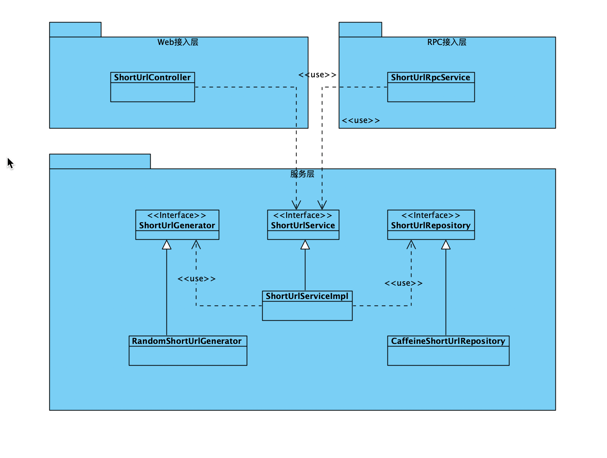
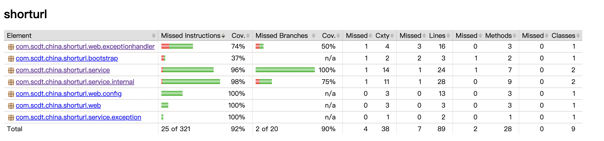
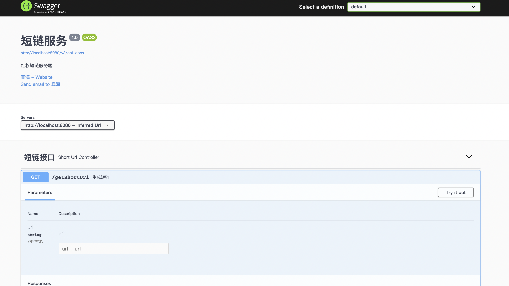
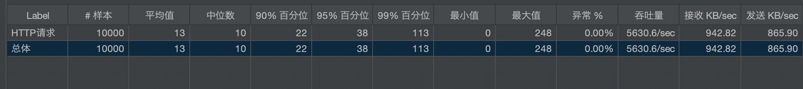

# 说明文档

## 系统设计图

## 设计思路

- 整体分为两层，服务层与接入层，本次只实现了Web接入层，RPC接入层类似，具体的协议由接入层与使用方制定
- 核心类为ShortUrlService、ShortUrlGenerator、ShortUrlRepository三个类，其中ShortUrlService定义了服务层的api，ShortUrlGenerator、ShortUrlRepository两个类定义了短链算法与存储的spi
- 三个核心类都可以有不同实现，其中本次实现都是直接使用三方库，算法使用apache-common-lang的RandomStringUtils随机算法；存储使用Caffeine，并发通过ConcurrentHashMap来控制；ShortUrlServiceImpl处理短链冲突时简单重试
- 系统可以扩展为自动发现spi实现，本质上RandomshortUrlGenerator与CaffenieShortUrlRepository与外部spi实现等同；通过扩展ShortUrlGenerator可以实现递增、hash、算法组合等，通过扩展ShortUrlRepository可以实现分布式存储；通过扩展ShortUrlService，可以实现不同压力情况的重试策略，算法选择等

## 系统假设

- 并发情况一般，由于是伪随机，大并发情况下冲突较多，会3次重试后容易生成短链失败
- 缓存存储，比较适合临时获取短链场景，例如验证邮件等

## 测试覆盖率

## api文档

## 性能测试

