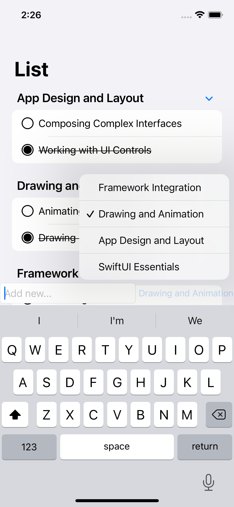

# SwiftUI Demo

## Development Environment
* Xcode 13.1 
* iOS 15.0
* Simulator iPhone 13

## Demo Introduction
The demo trying to call a fake endpoint by using `URLSession` with `Combine`, but I do not use its data instead of loading locally data from `sample.json` file and ignore all errors of HTTP response.
* `ContentView.swift` is the main view.
* `ToDoListViewModel` is the view model of `ContentView.swift`.
* `ToDoListAPI.swift` is used to handle Http requests.

## Author
张世雄(Vic Zhang)
zsx_wust@126.com

## Screenshots

(main screen)

(Adding a new item)

(add two items *Test* and *Test11111* and then finish *Test*)

(Editing *Working with UI Controls* item)

(*Composing Complex Interfaces* and *Working with UI Controls* are deleted)

(Searching)