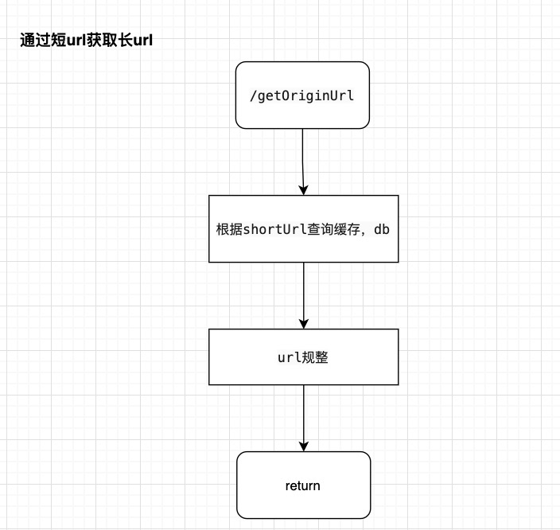
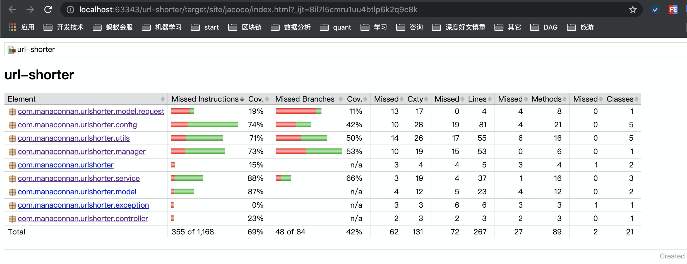

#short-url设计思路
###转为短url

1、使用MurmurHash 更高效的生产hash值，  该哈希算法是非加密型算法，性能更高。 将MurmurHash 算法得到的10进制数据转换为62进制， 得到6位的短url

2、使用bloom过滤器判断url是否有可能存在， 这里之所以直接查缓存，是因为缓存中存入的数据是有限的，存储的url很可能不在缓存中，而是存在数据库db中， 而查询db是非常耗时的操作， 所有需要事先判断 url是否有可能存在。 如果有可能存在， 在逐级从 缓存和db中 更加hash值作为key查询存储的url
（注意点： 这里之所以使用hash值作为key，而不是使用url作为key 直接查询， 是因为很多缓存中间件如redis对key的长度是有要求的，在db中的索引也有对key的长度有限制的， 如mysql在Innodb表中， utf8编码的情况下，单列索引长度限制是255）
3、 判断查询出来的url 与传入的url是否一致， 避免哈希碰撞引起的url不一致问题， 如果不一致，则在原url中加入一个后缀， 重新计算hash

4、本地缓存，控制缓存数据量，避免OOM 。 获取当前系统的最大可用堆内存， 初始化本地缓存的时候，根据可用堆内容 ， 加上预估一个url长度最长500字节， 按80%的使用率，计算出cache的最大size，设计一个LRU缓存器， 做到first in first out，及时清理缓存

5、 存储，异步存储。 这里有个细节，就是要保证存储顺序： 
    1、本地缓存-->2、bloom过滤--->3、分布式缓存（代码未实现）---> 4、db存储（代码未实现)

*****
##获取长url

说明： 略

###short-url 设计思路
https://www.yuque.com/docs/share/30d67254-4562-4a87-9bdf-b997206bd760?# 

###jacoco测试截图

