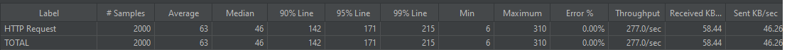
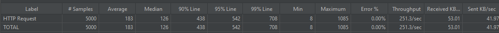
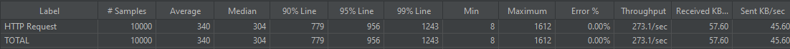

#### 测试方式:

通过jmeter进行多路并发压测/url/short/generate接口，使用RandomString方法动态生成随机url，测试20路/50路/100路并发时，系统的吞吐量和响应时间分位数

#### 服务部署方式：

url-converter-service-web 部署双节点，使用nginx upstream进行负载均衡配置

url-converter-service-impl 部署单节点，指定堆内存大小固定为4G

#### 测试机器配置：

CPU：Intel Core(TM) i5-7200U

内存：8G

系统： Windows10 64位

#### 测试结果 

20路并发，100轮测试结果如下：

平均响应时间63ms, 响应时间分位数P90为142ms, P95为171ms, 吞吐率为277/s

50路并发，100轮测试结果如下：

平均响应时间183ms, 响应时间分位数P90为438ms, P95为542ms, 吞吐率为251/s

100路并发，100轮测试结果如下：

平均响应时间340ms, 响应时间分位数P90为779ms, P95为956ms, 吞吐率为273/s