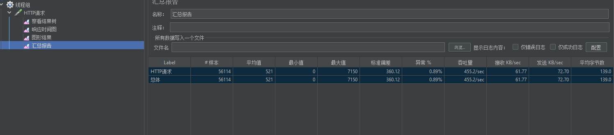
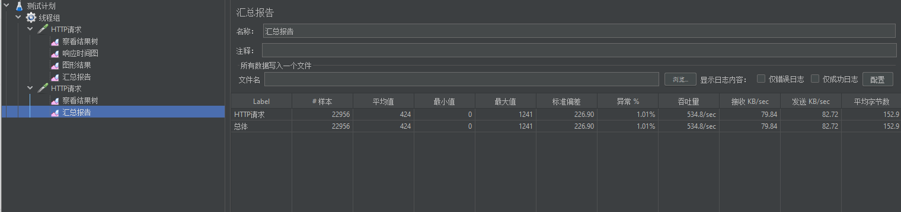

# 一、设计思路
 
````
  基本思路为将长域名和短域名一一对应，直接将长域名通过算法转换成短域名比较复杂，
  可以采用发号器的策略，给每个请求的长域名一个不同的编号，然后对每个编号进行算法
  转换，存储其对应关系，这里采用一个自增长的数字。
````
1.将请求中的长域名分配一个数字id
   - 一般短域名中包含大小写字母和数字共62个字符，62^8 ≈ 200W亿，一般情况下够用

2.将数字id通过算法压缩，并存储id和长域名的对应关系，使用ConcurrentHashMap
  - 算法为10进制转62进制

3.为了防止因请求过多、map存储key过多而内存溢出，可以设置一个过期策略，例如LRU，所以
  上述中的map可以使用ConcurrentLinkedHashMap(实现了LRU的concurrentHashMap)

4.短域名转换则反过来，首先将短域名通过算法转化为分配的id，然后从对应关系中找到对应
  的长域名
   
# 二、架构设计图


# 三、接口访问地址
[swagger](http://localhost:8080/exam/swagger-ui.html)

# 四、性能测试
 - 采用jemeter进行测试
 - 线程组配置为1S内启动500线程并循环
 - 异常为jemeter点击stop

